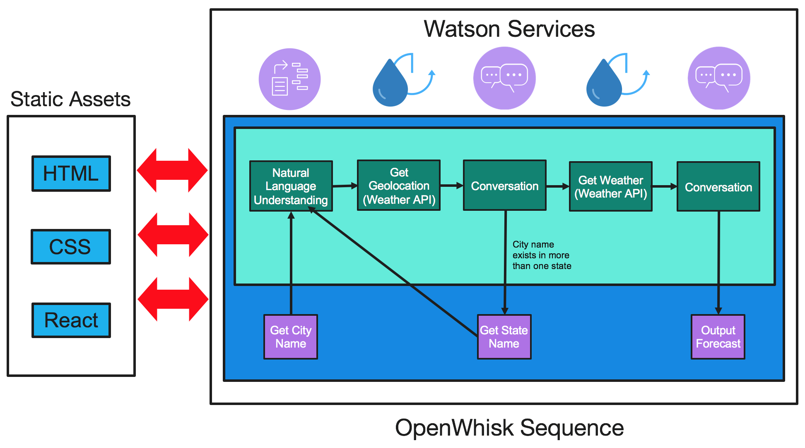
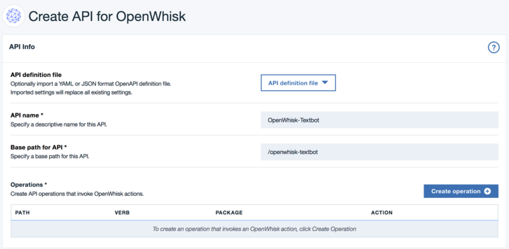
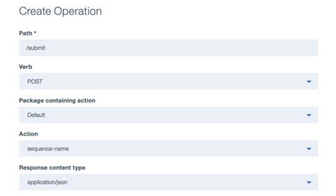
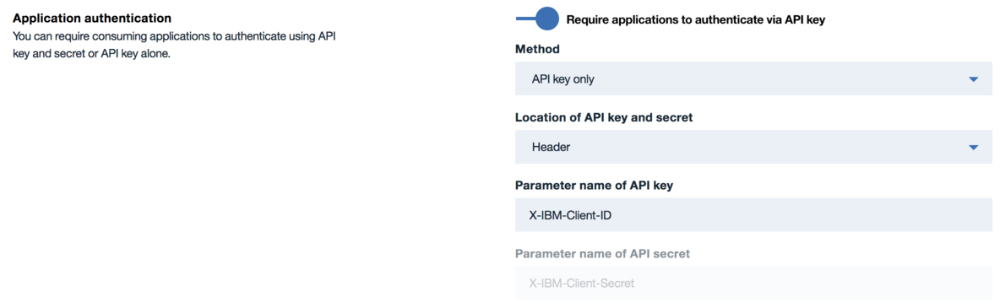
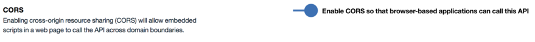

# Watson Weather Chat Bot using OpenWhisk

[](https://travis-ci.org/watson-developer-cloud/text-bot-openwhisk) [](https://codecov.io/gh/watson-developer-cloud/text-bot-openwhisk)

This project gives you the current weather forecast for your city (U.S. only as of now). The Weather Bot is based off the [Watson Weather Bot](https://github.com/watson-developer-cloud/text-bot) and uses Watson Assistant (formerly Conversation), Natural Language Understanding, and The Weather Company Data API. It is run with [OpenWhisk](https://console.bluemix.net/openwhisk/).

To see a list of IBM Services, visit here: https://console.bluemix.net/catalog/

<p align="center">
  
</p>

## Deploy to IBM Cloud

To deploy this application to IBM Cloud, click the **Deploy to IBM Cloud** button below.

[](https://bluemix.net/devops/setup/deploy?repository=https://github.com/watson-developer-cloud/text-bot-openwhisk)

**Note**: Please ensure that your IBM Cloud organization has enough space for one web application using 256MB of memory and for 4 services (CloudantDB, Watson Assistant (Conversation), NLU, and Weather Insights) and that you have enough space for another Watson Assistant workspace (up to 6 total).

## Table of Contents
 - [The Architecture](#the-architecture)
 - [Getting Started](#getting-started)
   - [Setting up IBM Cloud](#setting-up-ibm-cloud)
   - [Creating the Watson services](#creating-the-watson-services)
 - [OpenWhisk Setup](#openwhisk-setup)
   - [Cloudant Integration and Setup](#cloudant-integration-and-setup)
     - [Creating the actions](#creating-the-actions)
     - [Additions to the React app](#additions-to-the-react-app)
   - [Create an API](#create-an-api)
- [Run the React App](#run-the-react-app)
- [Cloud Foundry Deployment](#cloud-foundry-deployment)
- [Future Updates](#future-updates)

## The Architecture


## Getting Started

### Setting up IBM Cloud

1. If you do not already have an existing IBM Cloud account, sign up [here](https://console.bluemix.net/registration).
2. Clone this repository and go to the cloned directory.
   ```none
   git clone https://github.com/watson-developer-cloud/text-bot-openwhisk.git
   cd text-bot-openwhisk
   ```
3. Download and install the [Cloud-Foundry CLI](https://github.com/cloudfoundry/cli).
   * Alternatively, you can create the necessary services by going to your [IBM Cloud dashboard](https://console.bluemix.net/dashboard/watson).
4. Once the CLI has been set up and the repo has been cloned, open a terminal window and connect to IBM Cloud by doing the following:
   ```none
   cf api https://api.ng.bluemix.net
   cf login
   ```
5. Open the manifest.yml file located in the root directory of your cloned repository. Replace the content in the ```name: ``` field with a unique name for your application. The name you specify in this field will become your application's URL, <app name>.mybluemix.net.
   ```yml
   ---
   declared-services:
     watson-assistant-service:
       label: conversation
       plan: free
     cloudantNoSQLDB-service:
       label: cloudantNoSQLDB
       plan: Lite
   applications:
   - path: .
     memory: 256M
     instances: 1
     name: text-bot-openwhisk   # REPLACE ME
     buildpack: https://github.com/cloudfoundry/staticfile-buildpack.git
     disk_quota: 1024M
     services:
     - cloudant-text-bot
     - weather-text-bot
     - nlu-text-bot
     - watson-assistant-text-bot
   ```

### Creating the Watson services

1. Create an instance of the **Watson Assistant (formerly Conversation)** service and set your credentials by issuing the following commands (our CLI is being updated, for now, use the `create-service conversation` command): 
   ```sh
   cf create-service conversation free watson-assistant-text-bot
   cf create-service-key watson-assistant-text-bot theKey
   cf service-key watson-assistant-text-bot theKey
   ```

2. Create an instance of the **Natural Langauge Understanding** service and set your credentials by running the following:
   ```sh
   cf create-service Natural-Language-Understanding free nlu-text-bot
   cf create-service-key nlu-text-bot theKey
   cf service-key nlu-text-bot theKey
   ```

3. Create an instance of the **Weather Insights** service and set your credentials by running the following:
   ```sh
   cf create-service weatherinsights Free-v2 weather-text-bot
   cf create-service-key weather-text-bot theKey
   cf service-key weather-text-bot theKey
   ```

4. Create an instance of the **Cloudant NoSQL** Database and set your credentials by running the following commands:
   ```sh
   cf create-service cloudantNoSQLDB Lite cloudant-text-bot
   cf create-service-key cloudant-text-bot theKey
   cf service-key cloudant-text-bot theKey
   ```

5. Before moving on, you must train your Watson Assistant service in order to use this application. The training data is provided in the `.bluemix/workspace.json` file. To train the Watson Assistant model, follow the steps below:
   1. Go to your [IBM Cloud services dashboard](https://console.bluemix.net/dashboard/services).
   2. Select the Watson Assistant service you created for this application.
   3. Click on the  button. This will take you to the Watson Assistant training tool, which you will create a workspace for in the next step.
   4. Once the page has loaded, you are going to **Import** a workspace by clicking the  button, which is next to the Create button.
   5. Click on **Choose a file** and navigate to the `.bluemix` folder in your cloned repository. Select the `workspace.json` file and make sure the box that says **Everything (Intents, Entities, and Dialog)** is selected.
   6. Next, click **Import** to upload the training data and create your Watson Assistant workspace.
   7. After this has completed, you will be able to access your Watson Assistant Workspace ID by clicking the button with the three vertical dots (located in the upper right corner of the Workspace pane), and then selecting **View Details**. You will need the Workspace ID when you create the OpenWhisk actions for Watson Assistant (formerly Conversation).

## OpenWhisk Setup

1. Download and install the [OpenWhisk CLI](https://console.bluemix.net/openwhisk/learn/cli), then follow the steps on that page to set up your OpenWhisk Namespace and Authorization Key.

2. You will be creating 5 actions (not including actions for the Cloudant DB) for the weather chat bot as follows:
   ```none
   wsk action create conversation1 actions/watson-assistant.js --web true
   wsk action create conversation2 actions/watson-assistant-weather.js --web true
   wsk action create nlu actions/nlu.js --web true
   wsk action create getGeoLoc actions/getGeoLoc.js --web true
   wsk action create getWeather actions/getWeather.js --web true
   ```
3. Change to the config directory and replace the default parameters with your Watson service credentials. Your credentials can be found by heading to your [IBM Cloud dashboard](https://console.bluemix.net/dashboard/apps), clicking on the service name, and then the **Service Credentials** tab on the left-hand side of the page.
   ```none
   cd config
   ```

   **Watson Assistant Credentials**
   ```json
   {
    "WATSON_ASSISTANT_USERNAME": "<YOUR WATSON ASSISTANT SERVICE USERNAME>",
    "WATSON_ASSISTANT_PASSWORD": "<YOUR WATSON ASSISTANT SERVICE PASSWORD>",
    "WATSON_ASSISTANT_URL": "https://gateway.watsonplatform.net/conversation/api",
    "WORKSPACE_ID": "<YOUR WATSON ASSISTANT SERVICE WORKSPACE_ID>"
   }
   ```
   Your workspace ID can be found by going to your [IBM Cloud dashboard](https://console.bluemix.net/dashboard/apps), clicking on your Watson Assistant service,
   then clicking on the Launch Tool button. 

   **NLU Credentials**
   ```json
   {
    "NLU_USERNAME": "<YOUR NLU SERVICE USERNAME>",
    "NLU_PASSWORD": "<YOUR NLU SERVICE PASSWORD>",
    "NLU_URL": "https://gateway.watsonplatform.net/natural-language-understanding/api",
   }
   ```
   **Weather Company Data Credentials**
   ```json
   {
    "WEATHER_URL": "<YOUR WEATHER SERVICE URL>",
    "WEATHER_USERNAME": "<YOUR WEATHER SERVICE USERNAME>",
    "WEATHER_PASSWORD": "<YOUR WEATHER NSERVICE PASSWORD>"
   }
   ```
4. Export your service credentials by performing the following:
   ```sh
   wsk action update conversation1 --param-file config/watson-assistant-config.json
   wsk action update conversation2 --param-file config/watson-assistant-config.json
   wsk action update nlu --param-file config/nlu-config.json
   wsk action update getGeoLoc --param-file config/weather-config.json
   wsk action update getWeather --param-file config/weather-config.json
   ```
5. Finally, create an OpenWhisk sequence to connect the actions:
   ```none
   wsk action create <sequence name> --sequence nlu,getGeoLoc,conversation1,getWeather,conversation2
   ```

6. Copy and paste the following command in a terminal window and replace <sequence name> with the name of your OpenWhisk sequence. If you get a JSON response with no status error messages, then your sequence has been successfully created.
   ```bash
   wsk action invoke --blocking <sequence name> --param conversation '{ "input": { "text": "Hello", "language": "en" }, "context": {} }'
   ```

### Cloudant Integration and Setup

If you do not intend to have database support for your application, then you can skip to the [Create an API](#create-an-api) section.

#### Creating the actions

OpenWhisk actions to use the Cloudant Database have been included, and allow your application to insert, read, and write Watson Assistant contexts to the database. Once set up, the actions will be ready to use but require some additions to the UI to handle database IDs and Revision numbers (for updating documents). Follow the instructions below to create the Cloudant OpenWhisk actions.

1. Open a terminal window and create the 3 Cloudant actions below:
   ```none
   wsk action create cloudant-add actions/cloudant-add.js --web true
   wsk action create cloudant-read actions/cloudant-read.js --web true
   wsk action create cloudant-write actions/cloudant-write.js --web true
   ```
2. Navigate to the config folder and replace the placeholder text with your Cloudant credentials.
   ```none
   cd config
   ```

   ```json
   {
    "CLOUDANT_USERNAME": "<YOUR CLOUDANT USERNAME>",
    "CLOUDANT_PASSWORD": "<YOUR CLOUDANT PASSWORD>",
    "CLOUDANT_URL": "<YOUR CLOUDANT URL>"
   }
   ```
   Your credentials can be found by heading to your [IBM Cloud dashboard](https://console.bluemix.net/dashboard/apps), clicking on the Cloudant service name you created, and then the Service Credentials tab. Then, click on the "View credentials" dropdown
   associated with the API key you will use. You will need the username, password, and URL of your Cloudant DB.

3. Next, export your service credentials by doing the following commands:
   ```sh
   wsk action update cloudant-add --param-file config/cloudant-config.json
   wsk action update cloudant-read --param-file config/cloudant-config.json
   wsk action update cloudant-write --param-file config/cloudant-config.json
   ```
4. Finally, create an OpenWhisk sequence to connect all the actions:
   ```sh
   wsk action create <sequence name> --sequence cloudant-add,cloudant-read,nlu,getGeoLoc,conversation1,getWeather,conversation2,cloudant-write
   ```
5. You can test your sequence by copying and pasting the following command in a new terminal window.

   ```sh
   wsk action invoke --blocking <sequence name> --param conversation '{ "input": { "text": "Hello", "language": "en" }, "context": {} }' --param _id test --param _rev null
   ```
   If you get a JSON response with no status error messages, then your sequence has been successfully created.

6. To ensure that your document is saved in your Cloudant DB instance, go to your [IBM Cloud dashboard](https://console.bluemix.net/dashboard/apps), click on your Cloudant DB service instance, then click on the **Launch** button. Once you are viewing your list of **Databases**, click on the name of your weather bot database. If you see an entry with the same ID number used in the `wsk` command, then your sequence has sucessfully written to the database. If you would like to view the context that has been saved, then check the **Include Docs** box at the top of the page.

#### Additions to the React app

* Cloudant integration requires the DB document's `_id` and `_rev` to be passed in the UI.
* The document ID numbers should be UUIDs. Install the Node [UUID Package](https://www.npmjs.com/package/uuid) and follow the instructions on how to generate the IDs.

## Create an API

1. Go to the [OpenWhisk API Management Console](https://console.bluemix.net/openwhisk/) and then click on .
2. Enter a name for your API and specify a base path:
   
3. Next, click on .
4. Create a POST operation for your API and specify the OpenWhisk sequence created earlier as the Action that will be used:

   
5. In the **Security and Rate Limiting** section, enable the following:
   1. **Application authentication**
   
   2. **CORS**
   
6. Then, click **Save and expose**.
7. Now, create API keys for sharing within IBM Cloud and outside of IBM Cloud by clicking .
8. To test your API, navigate to the **API Explorer** tab. Copy and paste the following command in a terminal window. Replace the `--url` flag with the route and path for your POST request, and replace the `default` API key with yours. To generate an `id`, click on **Try it**, which is to the right of **Examples**, and then click **Generate** under the **Parameters** section to generate an ID.
   ```bash
   curl --request POST --url <YOUR POST PATH> --header 'accept: application/json' --header 'content-type: application/json' --header 'x-ibm-client-key: <YOUR API KEY>' --data '{"id":<GENERATED ID>, "conversation": { "input": { "text": "Hello", "language": "en"}, "context": {}}}'
   ```
## Run the React App
1. Ensure that you have [Node.js](https://nodejs.org/en/download/) installed on your machine. You can also use [Homebrew](https://brew.sh/) to install Node.
2. Make sure you are in the root directory in your cloned repository.
3. Install the **node-modules** needed to run the app by typing the following in a terminal window. NPM stands for Node Package Manager and is installed when you install Node.
   ```none
   npm install
   ```
4. Next, install the Create React App package.
   ```none
   npm install create-react-app
   ```
5. You should now be able to run the app locally on **localhost:3000** by typing the following:
   ```none
   npm start
   ```

## Cloud Foundry Deployment
1. Follow the instructions for [Run the React App](#run-the-react-app) before moving on to this section.
2. Make sure you are in the root directory in your cloned repository.
3. Then build the app for production.
   ```none
   npm run build
   ```
4. You can change the following fields in the `manifest.yml` if you like.
   ```none
   name: <Your App Name>
   ```
5. Push the app to Cloud Foundry by doing the following command:
   ```none
   cf push
   ```

## Future Updates
* ~~Cloudant DB integration and the creation of actions to get and store information within the database~~
* ~~Ability to query a certain day within the 7-day forecast for your city~~
* ~~Build a UI~~
* Output a list of states for the user to choose from should a city name occur in more than one state
* Improve city detection accuracy
